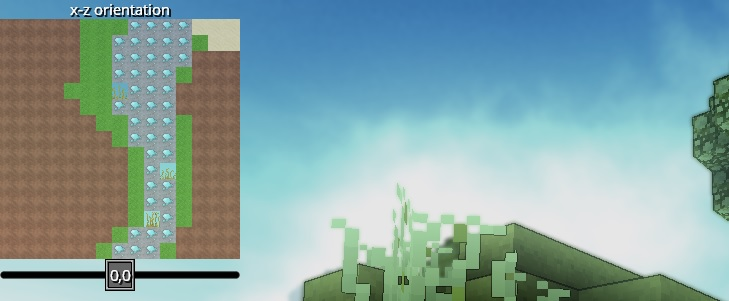

# Minimap

This module adds a minimap to the UI using the HUD Element system.

`M` toggles the map visibility.

`Number-Pad-Zero` switches view-plane axes.

`Number-Pad-Minus` and `Number-Pad-Plus` decrease and increase the offset along the primary view axis.

### License

This module is licensed under the [Apache 2.0 License](http://www.apache.org/licenses/LICENSE-2.0.html). 
